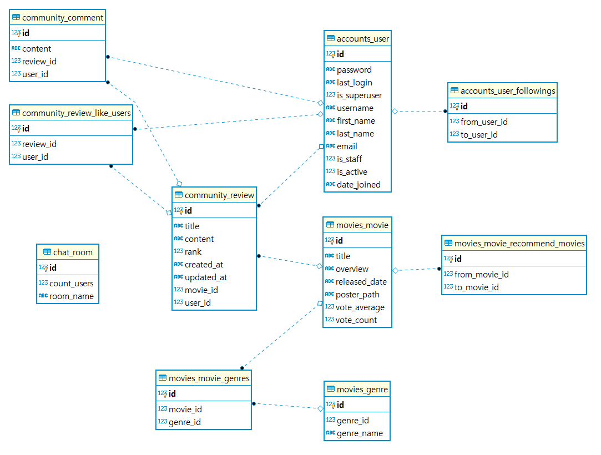
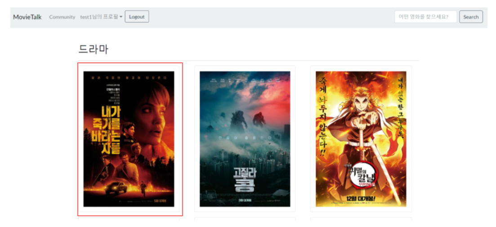
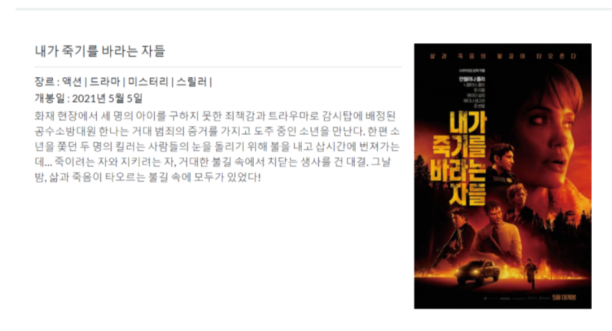
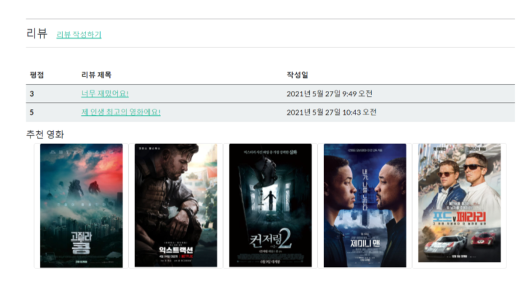
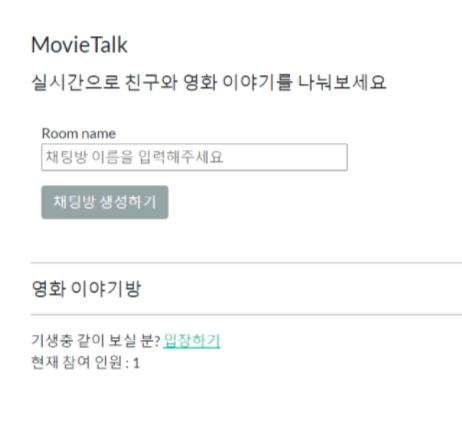
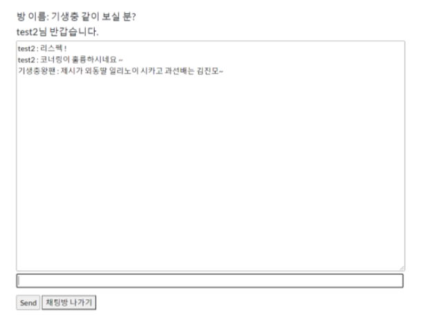
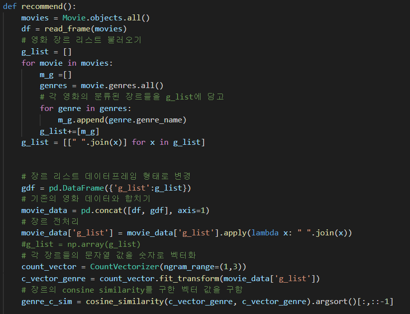
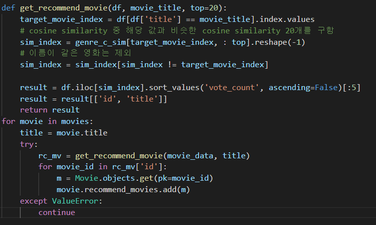

# 영화 커뮤니티 서비스(실시간 채팅 + 추천 알고리즘)

## 팀원 구성(2인) 및 업무 분담 내역

- 이용훈(팀장) : 실시간 채팅, TMDB API 활용한 Data 수집, DB 모델링, 영화 검색, 기본 UI/UX 디자인 기능 구현 
- 익명 : 소셜 로그인 기능, 추천 알고리즘을 활용한 영화 추천 기능, AWS를 활용한 배포
- 그외 회원가입, 정보 수정, 탈퇴, 리뷰, 댓글 생성, 삭제, 수정 등은 Driver-Navigator 방식의 공동 작업


### 프로젝트 기간

- 2021.05.20 ~ 2021.05.27


### 프로젝트 저장소([Github](https://github.com/Final-movie-pjt/django))


### 협업 과정

프로젝트를 시작하기에 앞서 팀원과 몇 가지를 합의하고 시작했다.

1. Django만을 사용할 것인지, Vue.js를 같이 사용할 것인지
   - 둘다 백엔드 개발에 관심이 컸고, 자바스크립트를 사용하는데 익숙하지가 않았다. 또한 나는 웹소켓을 사용한 실시간 채팅을 구현하는데 관심이 컸고, 다른 팀원은 배포와 추천 알고리즘에 관심이 많았다. 그래서 짧은 개발 기간을 감안했을 때 학습과 개발하는데 큰 비용이 지불될 것으로 예상하여 둘다 사용이 익숙한 Django만을 사용하기로 합의하였다.
2. 프로젝트의 목적을 무엇에 둘 것인가
   - UI/UX 디자인에 시간을 많이 쓸 것인지 아닌지에 대해서는 최소한의 시간 투입을 하기로 하였다.
   - 프로덕트의 관점에서 완성도가 높고 시장에 통할만한 제품을 만들고 싶은지, 아니면 써보지 않은 기술과 관심을 가지고 있는 기술을 배우는 입장에서 구현을 해보는 것 자체에 목적을 둘 것인지에 대해 고민을 하였다. 이 부분에 대해서는 후자의 방식을 선택하였다.
3. 모든 합의 과정과 개발 과정, 이슈 등을 문서화하여 공유할 것. 그리고 현재 어떤 일을 왜, 어떻게 하고 있는지 명확하게 표현하고 공유할 것.


### 협업 방식

#### 1. 이슈 트랙킹 + 일정 관리 : Trello

#### 2. Git Commit Convention : Udacity


## 기능 구현

1. 기본 커뮤니티 기능(유저 생성, 수정, 탈퇴 + 영화 정보 제공 + 리뷰 생성 및 삭제, 수정 + 리뷰 좋아요 + 댓글 생성 등)
2. 실시간 채팅
3. 영화 추천 알고리즘
4. 소셜 로그인
5. 영화 검색


### Product Concept

```
컨텐츠 기반의 추천 알고리즘으로 영화 추천 받고

영화에 관해 다양한 사람들과 실시간으로 대화를 나눠보자!

```


### ERD




### 개발 환경

- Windows 10 (Local)
- Ubuntu LTS 18.04(AWS EC2, 배포)
- VS Code
- Cloud 9


### 기술 스택

- Vanilla javascript
- Bootstrap5
- Axios
- Sqlite3
- Python 3.8
- Django 3.2
- Channels 3.0
- django-pandas 0.6.4
- scikit-learn 0.24.2
- NginX
- Daphne


### 화면구성

#### 1. 메인화면 


#### 2. 장르별 영화



#### 3. 영화 세부 정보



#### 4. 영화 리뷰 및 추천 정보



#### 5. 리뷰 세부 정보


#### 6. 로그인


#### 7. 실시간 채팅






## 상세 기능 구현 설명

### 1. 실시간 채팅

- Django Channels와 HTML5 WebSockets 활용

- Django channels 공식 문서의 [튜토리얼](https://channels.readthedocs.io/en/stable/tutorial/part_1.html)을 기반으로 해서 제작

- ASGI와 AsyncWebsocketConsumer를 활용하여 비동기 실시간 채팅 서버 구현

- Channel Layers로 InMemoryChannelLayer 사용

   - Channels 공식 문서에서는 본래 서버가 여러 대일 경우 인메모리를 사용하게 되면 채팅방 화면에 보여지는 데이터의 일관성이 깨지고, 채팅방과 이용 유저가 많으면 속도가 매우 느려지는 문제가 있어서, 테스트/개발단계가 아니라면 Channel layers로 Redis를 사용할 것을 권장하나, 아래와 같은 이유에서 인메모리를 사용
     1. 현재 단계가 완성된 단계가 아닌 프로토 타입인 점
     2. 단일 서버로 운영하고 있다는 점

- Redis의 Channels 라이브러리와의 버전 충돌 이슈와 배포 문제

    	1. redis 최신 버전을 설치시 통신 오류가 발생하는데, 이를 해결하려면 channels-redis를 2.x 버전을 사용하면 문제가 해결이 되었다.

    2. 하지만 channels-redis를 2.x 버전으로 설치하면 channels도 2.x 버전으로 자동 설치되는데, routing에 사용하는 메소드인 as_asgi()가 2.x버전에서는 동작하지 않는다. 억지로 channels의 3.x 버전을 따로 또 설치를 하게 되면 의존성 문제가 발생한다는 경고가 뜬다.

- Redis(또는 다른 NoSQL)를 사용해야하는 이유
  - Redis는 인메모리 데이터 구조라 속도가 빠르다. RAM에 키-값 쌍으로 데이터를 저장하기 때문에 키값을 입력하면 바로 값이 튀어나와서 속도가 빠르다.
  - Mongo DB는 디스크에 저장이 된다. 그래서 Redis에 비하여 시간이 더 소요된다. 또한 JSON 형태이기 때문에 데이터가 고도로 중첩되는 경우도 존재하기 때문에 이 경우에는 시간이 상대적으로 더 소요된다. 하지만 이 서비스에서 구현되는 채팅 서버의 경우 데이터가 고도로 중첩될 일은 없어서 이 부분은 크게 단점이 될 수 없을 듯이 보였다.

 - 한계 -> 추후 개선해야할 부분
    - 채팅방 이름, 참여 인원 등을 저장하는 Channel Layers에서 Redis를 사용하지 못하고 서버 자체 메모리를 사용했으며, 채팅방 관련 정보를 Sqlite3에 저장하여 활용
    
    - 채팅방의 참여 인원이 0이 되면 채팅방을 삭제하고 웹소켓을 닫는 형태로 구현하고, 채팅방 링크를 타고 들어갔을 때 채팅방 참여인원의 값을 증가시키는 형태로 구현하였는데, 
       1. 채팅방 참여 인원을 직접 User 객체를 Counting하지 않고 별도 Integer로 관리한다는 점
       
        2. 이 때문에 해당 채팅방에서 동일 유저가 새로고침을 하여도 참여인원이 한 명 늘어나버린다는 점 등의 문제가 존재
       
           ```python
           # chat/models.py
           
           from django.db import models
           from django.conf import settings
           
           # 채팅방 목록을 구성하고, 누가 참여하고 있는지 데이터를 만들고 방이 파괴되거나 사람이 나가면 제거
           
           class Room(models.Model):
               count_users = models.PositiveSmallIntegerField() # 채팅방에 참여한 사람 수
               room_name = models.CharField(max_length=255) # 채팅방 이름
               
           ```
       
           ```python
           # chat/consumers.py
           
           @database_sync_to_async
               def delete_user_or_room(self, room_id):
                   room = Room.objects.get(pk=room_id)
                   room.count_users -= 1
                   room.save()
                   if room.count_users <= 0:
                       room.delete()
           ```

### 2. 영화 검색

- Django ORM의 Q 객체 활용

  - Django Model ORM으로 where 절에 or, not, and 등의 조건을 추가할 때 사용

  - Title이나 Overview에 검색 단어가 있으면 결과를 보여주고, 결과가 없으면 자체 추천 영화를 제시

    


### 3. 추천 알고리즘 (Content based filtering)

* 선택한 영화의 장르를 바탕으로 영화를 추천

  선택한 상품 또는 물건( 장르, 종 등)의 특징을 바탕으로 추천을 해주는 방식인 Content based filtering을 적용을 했다. 이 때 DB에 있는 Data를 기반으로 추천을 해줘야 하기 때문에 DB에 있는 정보를 Django Pandas를 바탕으로 Model을 DataFrame 형태로 변환했다. 변환 후 장르 별로 추천을 해주기 위해서는 현재 가지고 있는 데이터를 전처리 할 필요가 있었다. 현재 모델에 있는 장르는 예를 들어서 '액션', '판타지', '가족' 등 이런식으로 다양한 장르가 속해있었다. 해당 장르를 하나의 리스트 형태로 묶었고 이 나눠져 있는 장르를 하나의 text로 묶어줬다. ([액션 판타지 가족])  그 후, 머신러닝 라이브러리인 scikit-learn을 활용하여 해당 장르의 text vector 값을 구해줬고 해당 각 장르의 vector 값을 Cosine-similarity를 통해서 근접한 값을 가지고 있는 장르를 20개를 뽑았다. 20개의 추천은 그 수가 너무 많다고 판단해 20개 중에서 사람들의 영화에 별점을 많이 준 수로 sorting 하여서 5개를 추천해주었다.

  * DataFrame 형태로 변환 후 전처리 과정

  

  

  * 영화 추천해주는 함수 구현

  


### 4. 소셜 로그인

* Django allauth를 활용한 소셜 로그인 구현

  Django allauth를 사용하여 Google 로그인, Naver 로그인을 구현했다. settings.py에 allauth 관련 내용들을 추가해주고 api를 요청할 각각의 사이트에서 우리가 개발하는 서버의 주소를 입력하고 요청 후 리다이렉트할 주소를 입력해줬다.

  


### 5. 배포


배포는 다음과 같이 적용했다.  

로컬에서 개발한 프로젝트를 원격저장소인 github에 올려 그것을 AWS의 공유 개발환경인 Cloud9  서비스를 통해 pull을 했다. 그리고 EC2를 생성하고 보안규칙을 수립한 뒤에 배포를 진행했다. Cloud9에서는 웹 서버인 Nginx와 uwsgi를 통해 서버 실행을 시키고 우리는 웹 소켓을 바탕으로 통신하는 실시간 채팅 기능이 있기 때문에 asgi에 대한 설정도 추가를 해줘야 했다. 

- 배포 관련 이슈
  - Channels를 사용할 때 Daphne라는 일종의 프로토콜 서버를 사용할 수 있었는데, 이를 통해 웹소켓 프로토콜 뿐만 아니라 HTTP 요청도 받을 수 있어서 따로 웹서버를 두지 않아도 된다고 공식 문서에는 나와있었다. 하지만 collect static이 불안정한 이슈가 있어서 Nginx를 일종의 Reverse Proxy 서버로 두고 HTTP 요청은 Nginx와 uWSGI가, 그외 요청은 Daphne와 ASGI가 처리할 수 있도록 하였다.
  - 로컬 개발 환경이었던 Windows10에서 channels 라이브러리를 설치하게 되면 Windows 환경에서 비동기 작업을 수행하기 위하여 IOCP 관련 라이브러리(twisted-icopsupport)가 설치된다. 그런데 배포에 활용된 EC2 서버는 Ubuntu LTS 18.04를 OS를 사용하고 있었고, IOCP는 Windows에서만 사용되기 때문에 requirements.txt를 설치할 때 존재하지 않는 라이브러리를 설치하려고 해서 에러가 발생한다. 그래서 이 부분을 제외하고 pip install 해줘야한다. (배포 서버용 requirements.txt를 만들어서 해결)


### 6. Axios를 활용한 부분

- 전반적으로 SPA 형태로 구현하지 않았지만, 리뷰의 좋아요 기능을 Axios를 활용하여 SPA 흉내를 내줬다. 

```javascript
// community/templates/community/detail.html

<script>
  
    const forms = document.querySelectorAll('.like-form')
    const csrftoken = document.querySelector('[name=csrfmiddlewaretoken]').value
    forms.forEach((form)=>{
      form.addEventListener('submit', (event)=>{
        event.preventDefault()
        const reviewId = event.target.dataset.reviewId 
        const URL = window.location.href + 'like/' 
      
        const requestData = {
          method: 'post', 
          url: URL, 
          headers: {'X-CSRFToken': csrftoken}, 
        }

        axios(requestData)
          .then((response)=>{

            const count = response.data.count 
            const liked = response.data.liked 

            const likeButton = document.querySelector(`#like-${reviewId}`)
            if (liked) {
              likeButton.style = "color:crimson;"
            }
            else {
              likeButton.style = "color:black;"
            }
            const likeCount = document.querySelector(`#like-count-${reviewId}`)
            likeCount.innerText = count
          })
          .catch((error)=>{
            console.log(error.response)
          })
      
      })
    })
 </script>
```


## 기타 - 느낀 점


1. 수업 때 배웠던 내용이 아닌 것들을 공식 문서와 인터넷 자료들을 뒤져가며 만들었다. 제대로 구현이 안되었던 것들이 많았지만 부족한 시간을 감안했을 때, 어느 정도 결과물을 만들어낼 수 있어서 자신감을 갖게 되었다. 그리고 이 과정에서 웹서버, WAS, CGI, ASGI, WSGI, 비동기 서버 구현 등에 관해 몰랐던 지식들을 얻을 수 있었다.
2. 자바스크립트에서 많이 마주하였던 콜백 함수의 형태는 다른 언어에서 람다 함수, 함수 객체, 함수 포인터 등의 형태로 적극적으로 활용되는 것을 많이 보았는데, 아직 그 구조의 이해도가 낮아서 활용하기가 어렵다. 많이 연습해볼 필요성을 느꼈다.
3. 지금까지 프로젝트에서는 DB ERD가 주어져있던 경우가 대다수였는데, 이번 프로젝트에서는 모델링부터 진행을 하여야 했다. 처음에 이 부분이 오래 걸릴거라고 생각하지 못하였는데, 일대일, 일대다, 다대다 관계를 설정하는 방법, Django ORM을 활용하여 Join table에 데이터를 넣고, 데이터를 가져오는 방법 등을 이해하는데 꽤 시간이 많이 걸렸다.
4. 배포하는데 참여하기는 하였으나 주도적인 역할을 담당하지는 않았다. 그래서 AWS, NginX 등을 사용하여 배포하는 부분에 대한 지식이 부족한데 이 부분을 추후에 혼자 해볼 생각이다.
5. 자바스크립트에 대한 지식이 부족하고, 클라이언트와 서버가 데이터를 주고받는 부분에 대한 이해가 부족하였다. 그래서 Vue.js를 활용할 여지가 없었고, SPA를 구현할 수도 없었다. Django Template Laguage를 주로 활용하였다. 추후에 Django Rest Framewrok, Serializers를 활용하여 REST API 형태의 서버로 만들고, 클라이언트와 통신하는 방식으로 Refactoring해보고자 하는 욕심이 있다. REST API 개발을 좀 더 공부해볼 계획이다.


## 참고 자료

- Daphne와 Nginx를 사용한 배포 문제 [victolee님의 블로그](https://victorydntmd.tistory.com/265)
- [WebSocket을 이용하여 클라이언트 애플리케이션 작성하기](https://developer.mozilla.org/ko/docs/Web/API/WebSockets_API/Writing_WebSocket_client_applications)
- [What role does Redis serve in Django Channels](https://stackoverflow.com/questions/63754950/what-role-does-redis-serve-in-django-channels)
- [레디스란 무엇일까](https://velog.io/@hyeondev/Redis-%EB%9E%80-%EB%AC%B4%EC%97%87%EC%9D%BC%EA%B9%8C)
- [Django channels 공식문서](https://channels.readthedocs.io/en/stable/)
- https://www.youtube.com/watch?v=ehpr3YHSQlQ
- [[Deploy] Django 프로젝트 배포하기 - 1. AWS](https://nachwon.github.io/django-deploy-1-aws/)
- [ec2에서 django와 channels를 이용하여 웹소켓 적용2](https://himanmengit.github.io/django/2019/01/07/django-channels-on-ec2-notification2.html)